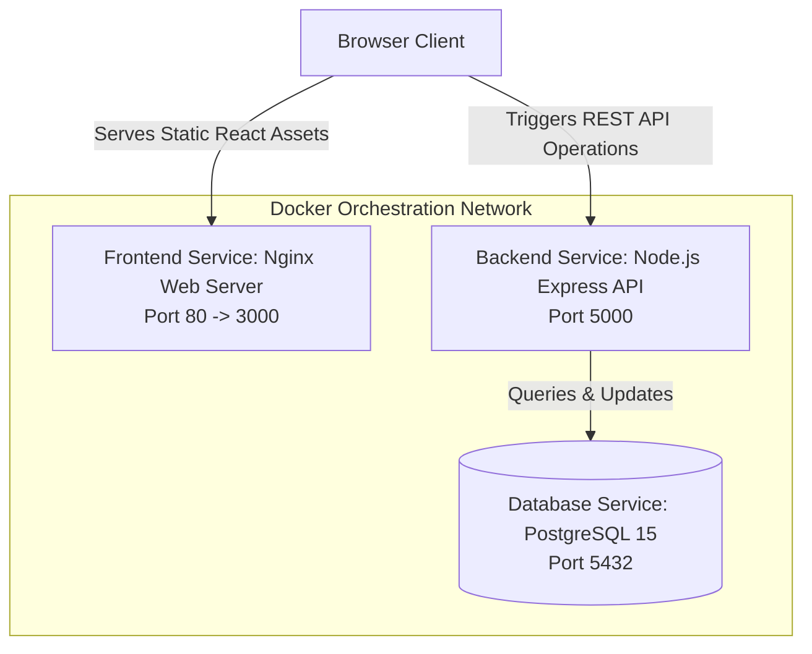
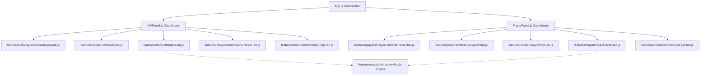

# 🏰 D&D Campaign Emporium - System Architecture & Design Choices

This document provides a comprehensive technical overview of the design choices, architectural layout, database schemas, API contracts, and containerized deployment configuration for the D&D 5e Campaign Emporium.

---

## 🗺️ System Architecture Diagram

The application is structured as a multi-tier containerized system orchestrated via Docker Compose:



---

## 🧩 Feature-Driven Development (FDD) Component Architecture

The frontend follows Feature-Driven Development (FDD) modularization principles, separating monolithic views into clean feature modules housed under `src/features/`:



---

## ⚙️ Design Choices

### 1. Database Engine: PostgreSQL 15 & JSONB
* **The Choice**: Containerized PostgreSQL 15 database service storing users, campaigns, characters, logs, and map collections.
* **Why JSONB**: D&D 5e attributes, player inventories, storefront listings, shop configurations, and multi-map arrays are nested objects. Storing these as `JSONB` columns in PostgreSQL provides:
  * **Flexibility**: Schema flexibility without complex multi-table join queries for equipment slots.
  * **Performance**: PostgreSQL provides native indexation and operators for querying inside JSON fields.
  * **Simplicity**: Keeps SQL schema migrations lightweight matching the frontend object structure directly.

### 2. Case-Insensitive SQL Safeguards
* **The Choice**: All database queries matching users and character sheets use `LOWER(username) = LOWER($x)`.
* **Why**: Prevents casing mismatch bugs if users log in with different casing variations, guaranteeing player campaigns and characters always resolve on dashboards.

### 3. Shared Interactive Map Engine
* **The Choice**: Extracted SVG map renderer into a shared `InteractiveMap.js` component used by both DM and Player views.
* **Why**: Consolidates landmark pin overlays, animated party travel indicators, and clicked coordinate draft pins into a single reusable rendering engine.

### 4. Multi-Stage Nginx Production Builds
* **The Choice**: The React frontend compiles into static production bundles served via lightweight `nginx:stable-alpine` containers.
* **Why**: Serving static web assets directly via Nginx maximizes performance, reduces RAM usage (~10-20MB), and isolates build environments from runtime.

---

## 💾 Database Schema

The database auto-initializes the following tables on startup:

```sql
-- Authentication Credentials
CREATE TABLE users (
  username VARCHAR(100) PRIMARY KEY,
  password VARCHAR(255) NOT NULL
);

-- D&D Campaigns with Multi-Map & Shop Systems
CREATE TABLE games (
  id VARCHAR(20) PRIMARY KEY,                       -- Campaign code (e.g. GAME1234)
  name VARCHAR(255) NOT NULL,
  description TEXT,
  dm_username VARCHAR(100) NOT NULL,
  store JSONB DEFAULT '[]'::jsonb,                 -- Global catalog inventory
  shops JSONB DEFAULT '[]'::jsonb,                 -- Active custom shop storefronts
  locations JSONB NOT NULL,                        -- Default map cities & landmarks
  party_location VARCHAR(100) NOT NULL,
  travel_state JSONB DEFAULT NULL,                 -- Active journey: { from, to, startTime, durationMs }
  map_url TEXT,                                    -- Default map PNG base64 string
  maps JSONB DEFAULT '[]'::jsonb,                  -- Multi-map array: [{ id, name, url, locations }]
  active_map_id VARCHAR(50) DEFAULT 'map_default', -- Map visible to players
  created_at TIMESTAMP DEFAULT CURRENT_TIMESTAMP
);

-- Character Sheets
CREATE TABLE characters (
  username VARCHAR(100) NOT NULL,
  game_id VARCHAR(20) NOT NULL,
  name VARCHAR(255) NOT NULL,
  race VARCHAR(100) NOT NULL,
  class VARCHAR(100) NOT NULL,
  level INT DEFAULT 1,
  hp_max INT NOT NULL,
  hp_current INT NOT NULL,
  stats JSONB NOT NULL,                            -- Attributes: { str, dex, con, int, wis, cha }
  gold JSONB NOT NULL,                             -- Gold purse: { gp, sp, cp }
  inventory JSONB DEFAULT '[]'::jsonb,
  created_at TIMESTAMP DEFAULT CURRENT_TIMESTAMP,
  PRIMARY KEY (username, game_id)
);

-- Campaign Logs Chronology
CREATE TABLE logs (
  id SERIAL PRIMARY KEY,
  game_id VARCHAR(20) NOT NULL,
  sender VARCHAR(255) NOT NULL,
  message TEXT NOT NULL,
  timestamp TIMESTAMP DEFAULT CURRENT_TIMESTAMP
);
```

---

## 🔌 API Endpoints Contract

| Endpoint | Method | Description |
|---|---|---|
| `/api/auth/register` | `POST` | Register a new user account (hashes password with `bcryptjs`) |
| `/api/auth/login` | `POST` | Authenticate user credentials |
| `/api/games` | `GET` | Retrieve list of all campaigns |
| `/api/games/:id` | `GET` | Retrieve campaign config details |
| `/api/games` | `POST` | Create a new campaign (generates campaign code ID) |
| `/api/games/:id` | `DELETE` | Delete campaign and cascading character/log records |
| `/api/games/:id/join` | `POST` | Validate player joining a campaign |
| `/api/users/:username/characters` | `GET` | Retrieve all character sheets owned by a user across campaigns |
| `/api/games/:id/characters` | `GET` | Retrieve list of all character sheets in a campaign |
| `/api/games/:id/characters/:username` | `GET` | Retrieve specific character sheet |
| `/api/games/:id/characters` | `POST` | Create a new character sheet |
| `/api/games/:id/characters/:username` | `PUT` | Update character sheet fields |
| `/api/games/:id/characters/:username` | `DELETE` | Discard/kick player character |
| `/api/games/:id/store` | `PUT` | Update catalog wares inventory |
| `/api/games/:id/shops` | `PUT` | Update shop storefront stock options |
| `/api/games/:id/locations` | `PUT` | Update map locations and landmarks |
| `/api/games/:id/locations-maps` | `PUT` | Update locations and multi-map collection atomically |
| `/api/games/:id/maps` | `PUT` | Update multi-map array and active map ID |
| `/api/games/:id/active-map` | `PUT` | Change published active map visible to players |
| `/api/games/:id/map-url` | `PUT` | Update default map PNG image layout |
| `/api/games/:id/travel` | `PUT` | Update travel journey state |
| `/api/games/:id/logs` | `GET` | Retrieve chronicle logs for a campaign |
| `/api/games/:id/logs` | `POST` | Add a new chronicle log entry |
