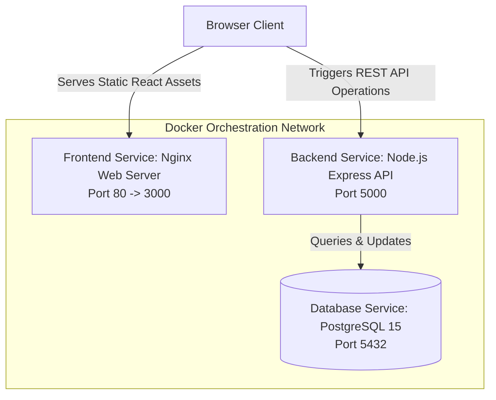

# 🏰 D&D Campaign Emporium - System Architecture & Design Choices

This document provides a comprehensive overview of the design choices, architectural layout, database models, and containerized deployment configuration for the D&D 5e Campaign Emporium.

---

## 🗺️ System Architecture Diagram

The application is structured as a multi-tier containerized system orchestrated via Docker Compose:



---

## ⚙️ Design Choices

### 1. Database Engine: PostgreSQL 15 & JSONB
* **The Choice**: We migrated from a client-side localStorage mock to a containerized PostgreSQL 15 database service.
* **Why JSONB**: D&D 5e stats dictionaries, character inventories, item properties, store wares catalogs, and shop lists are deeply nested structures that evolve frequently based on SRD updates. Storing these as `JSONB` (Binary JSON) columns in PostgreSQL provides:
  * **Flexibility**: We preserve the rich, dynamic object structures without writing complex multi-table joins or relational schemas for nested equipment.
  * **Performance**: PostgreSQL provides native indexation (e.g. GIN indexes) and operators for querying inside JSON fields.
  * **Simplicity**: Kept SQL database migrations lightweight, matching the existing frontend state objects directly.

### 2. Thick-Client / Thin-Backend Architecture
* **The Choice**: Business logic (such as checking item attunement limits, two-handed weapon slots blocking off-hands, gold coin divisions, and travel progress computations) runs **on the client** (`src/utils/db.js` layer inside the browser runtime). The Express backend acts as a strict storage engine.
* **Why**: Placing game mechanics calculations in the client UI layer keeps the API backend stateless, decoupled, and fast. The backend simply stores, validates, and serves the JSON state objects, preventing database driver bloat.

### 3. Production Serving: Nginx Multi-Stage Docker Builds
* **The Choice**: For production environments, the React application is compiled into optimized HTML/CSS/JS bundles in a builder stage. These assets are then copied to a lightweight `nginx:stable-alpine` container.
* **Why**: Serving static web assets directly via Nginx is extremely fast, uses minimal memory (~10-20MB), and isolates frontend build environments from production execution.

---

## 💾 Database Schema

The database auto-initializes the following tables on startup:

```sql
-- Represents authentication credentials
CREATE TABLE users (
  username VARCHAR(100) PRIMARY KEY,
  password VARCHAR(255) NOT NULL
);

-- Represents D&D Campaigns
CREATE TABLE games (
  id VARCHAR(20) PRIMARY KEY, -- Unique code (e.g. GAME1234)
  name VARCHAR(255) NOT NULL,
  description TEXT,
  dm_username VARCHAR(100) NOT NULL,
  store JSONB DEFAULT '[]'::jsonb, -- Store inventory catalog
  shops JSONB DEFAULT '[]'::jsonb, -- Active custom shops configurations
  locations JSONB NOT NULL,        -- Map cities and established landmarks
  party_location VARCHAR(100) NOT NULL,
  travel_state JSONB DEFAULT NULL, -- Active travels: { from, to, startTime, durationMs }
  map_url TEXT,                    -- Custom PNG uploader base64 image string
  created_at TIMESTAMP DEFAULT CURRENT_TIMESTAMP
);

-- Represents character sheets joined in campaigns
CREATE TABLE characters (
  username VARCHAR(100) NOT NULL,
  game_id VARCHAR(20) NOT NULL,
  name VARCHAR(255) NOT NULL,
  race VARCHAR(100) NOT NULL,
  class VARCHAR(100) NOT NULL,
  level INT DEFAULT 1,
  hp_max INT NOT NULL,
  hp_current INT NOT NULL,
  stats JSONB NOT NULL,            -- Attributes: { str, dex, con, int, wis, cha }
  gold JSONB NOT NULL,             -- Gold purse: { gp, sp, cp }
  inventory JSONB DEFAULT '[]'::jsonb,
  created_at TIMESTAMP DEFAULT CURRENT_TIMESTAMP,
  PRIMARY KEY (username, game_id)
);

-- Represents logs chronologies for campaigns
CREATE TABLE logs (
  id SERIAL PRIMARY KEY,
  game_id VARCHAR(20) NOT NULL,
  sender VARCHAR(255) NOT NULL,
  message TEXT NOT NULL,
  timestamp TIMESTAMP DEFAULT CURRENT_TIMESTAMP
);
```

---

## 🔌 API Endpoints Contract

| Endpoint | Method | Description |
|---|---|---|
| `/api/auth/register` | `POST` | Register a new user account (hashes password with `bcryptjs`) |
| `/api/auth/login` | `POST` | Log in to an account |
| `/api/games` | `GET` | Retrieve list of all campaigns |
| `/api/games/:id` | `GET` | Retrieve campaign config details |
| `/api/games` | `POST` | Create a new campaign (generates game code ID) |
| `/api/games/:id/join` | `POST` | Validates a player joining a campaign |
| `/api/games/:id/characters` | `GET` | Retrieve list of all character sheets in campaign |
| `/api/games/:id/characters/:username`| `GET` | Retrieve character sheet for a specific player |
| `/api/games/:id/characters` | `POST` | Create a new character sheet |
| `/api/games/:id/characters/:username`| `PUT` | Update character sheet fields |
| `/api/games/:id/characters/:username`| `DELETE`| Discard/kick player character |
| `/api/games/:id/store` | `PUT` | Update general catalog items |
| `/api/games/:id/shops` | `PUT` | Update custom storefront stock options |
| `/api/games/:id/locations` | `PUT` | Update custom landmarks and locations |
| `/api/games/:id/map-url` | `PUT` | Update custom PNG base64 map layouts |
| `/api/games/:id/travel` | `PUT` | Update current travel journey state |
| `/api/games/:id/logs` | `GET` | Retrieve chronicle logs for a campaign |
| `/api/games/:id/logs` | `POST` | Add a new chronicle log entry |
